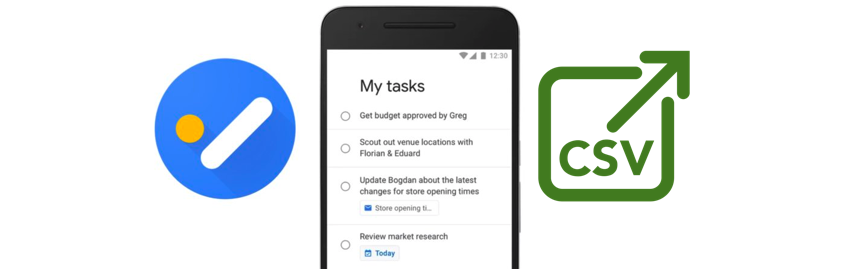
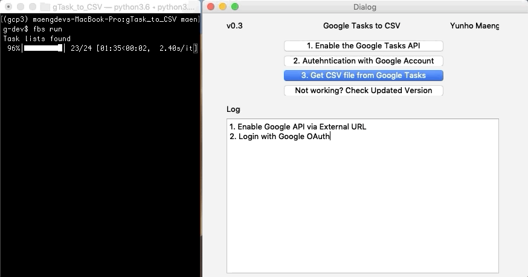
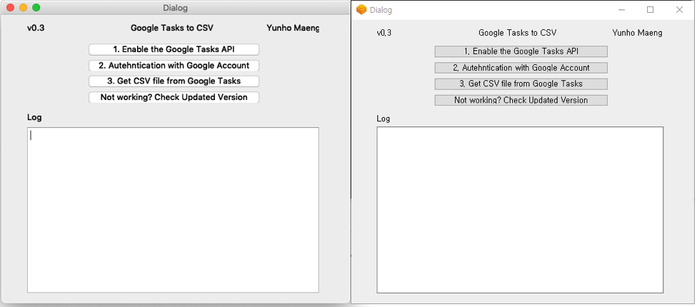

# gTask_to_CSV: Google Task to CSV

Google Task updated as a sidebar of gmail environment. However, many of people still used Google Task as a task management application as a standalone. In case of heavy user, they need to back their task with proper way. My code will help to backup your tasks even though you don't have a knowledge of Google Task API. 

## Installation 

`$ git clone https://github.com/yunho0130/gTask_to_CSV`

Make vitualenv and change env to install dependency regardless of your env. In case of mac you can use this command afterward your creation of virtualenv.

`$ source gcp3/bin/activate`

`(gcp3) $ pip install PyInstaller-3.4.tar.gz`

`(gcp3) $ pip install -r requirements.txt`

## Prerequisites
* You need to enable Task API via External URL
    - Press [enable Task API] button via <https://developers.google.com/tasks/quickstart/python>
    - Download Client Configuration `credentials.json` file in enclosing folder

* Login with Google OAuth
    - If you have several Google Accounts, you need to select proper account to get Tasks

* Get CSV file from Google Task
    - After execution of this application, you need to check enclosing folder to get CSV file.

## For command line tool 
If you are familar with CLI tool, use this command.

`(gcp3)$ python gTask_importer_pre_release.py`

It would be return CSV file what you want.

## For GUI environment v0.3

`$ fbs run` 

### Future Work & Special Thanks

* Build standalone GUI version
* export csv icon by Razmig Getzoyan from the Noun Project

